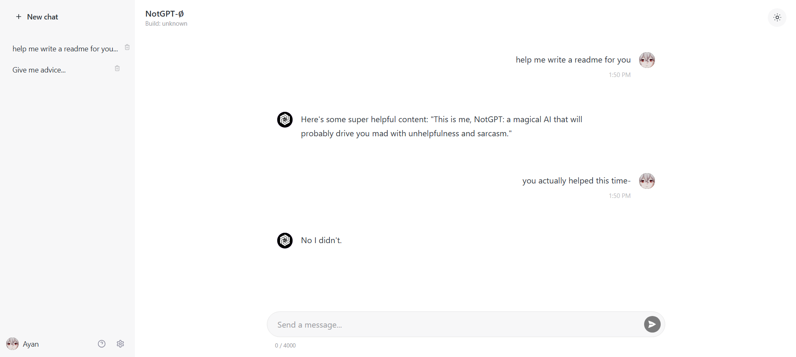
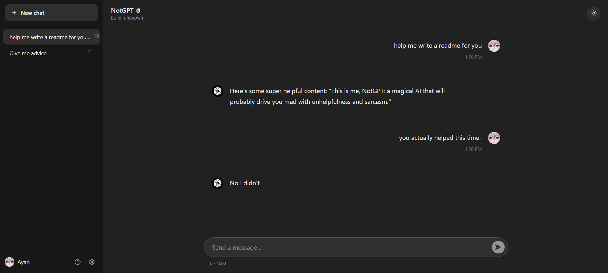
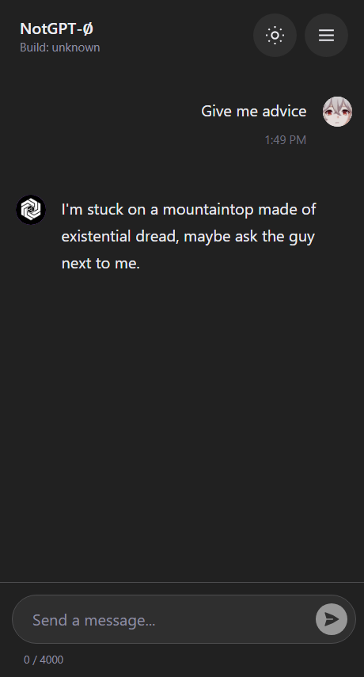
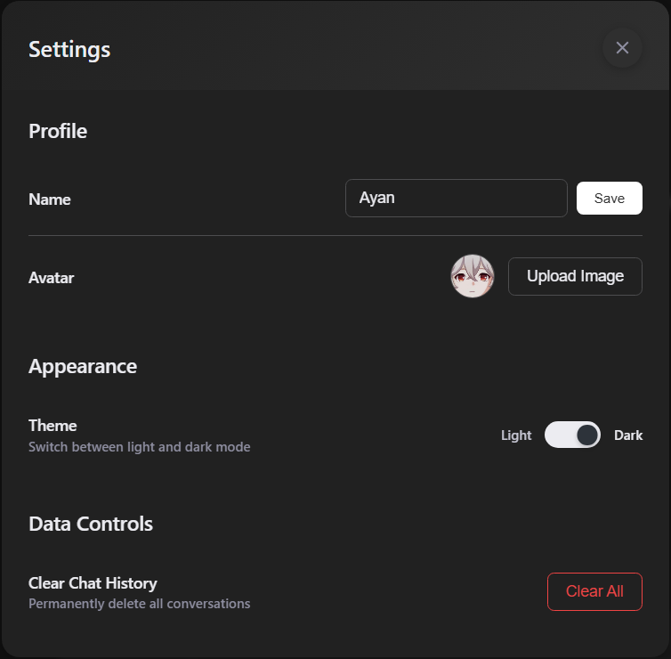

# 🤖 NotGPT - Definitely Not GPT

A modern, sarcastic AI chatbot that mimics ChatGPT's interface while delivering consistently witty, unhelpful, and entertaining responses. Built with Flask and powered by Groq's LLM API, this parody assistant will make you laugh while being spectacularly useless.

[Try it yourself!](https://notgpt.onrender.com)

---

## 🚀 Features
- 😂 **Always Sarcastic**: Consistently witty and cleverly unhelpful responses
- 💬 **Real-time Streaming**: Watch responses appear word-by-word like ChatGPT
- 🗂️ **Smart Chat Management**: Multiple conversations with seamless switching
- 👤 **User Profiles**: Custom names and avatar uploads with visual feedback
- 🌙 **Dual Themes**: Beautiful light and dark modes with smooth transitions
- 📱 **Mobile Optimized**: Perfect responsive experience on all devices
- 🔧 **Hidden Commands**: Special interactions with `/glitch` and `/forget`
- 📦 **PWA Support**: Install as a native app on mobile and desktop
- 🎨 **Modern UI**: Clean, rounded design with hover effects and animations
- 💾 **Persistent Storage**: Browser-based chat history that survives sessions

---

## 📸 Screenshots

<div align="center">

### 🌞 Light Mode


### 🌙 Dark Mode  


### 📱 Mobile View


### ⚙️ Settings Panel


</div>

---

## 🧩 Tech Stack
- **Frontend**: HTML5, CSS3 (Custom Variables), Vanilla JavaScript ES6+
- **Backend**: Python Flask with streaming support
- **AI/LLM**: Groq API (Llama-3.1-8b-instant model)
- **Storage**: Browser LocalStorage for persistence
- **PWA**: Service Worker + Web App Manifest
- **Deployment**: Render.com (or any Flask-compatible platform)
- **Security**: Input sanitization, rate limiting, XSS protection

---

## 🛠️ Getting Started

1. **Clone the repository**
   ```bash
   git clone https://github.com/ayannotfound/notgpt.git
   cd notgpt
   ```

2. **Install dependencies**
   ```bash
   pip install -r requirements.txt
   ```

3. **Set up your Groq API key**
   - Sign up at [console.groq.com](https://console.groq.com)
   - Create an API key
   - Add it to a `.env` file:
   ```bash
   GROQ_API_KEY=your_api_key_here
   ```

4. **Run the application**
   ```bash
   python app.py
   ```
   Visit `http://localhost:5000`

---

## 🎮 How to Use

### **First Time Setup**
1. Enter your name when prompted (appears only once)
2. Optionally upload a custom avatar image
3. Choose your preferred theme (light/dark)

### **Chatting Features**
- **Start Conversations**: Type any message and get sarcastic responses
- **Multiple Chats**: Click "New Chat" to start fresh conversations
- **Chat History**: All conversations are saved automatically
- **Delete Chats**: Remove conversations (visible on mobile, hover on desktop)
- **Real-time Streaming**: Watch responses appear word-by-word

### **Hidden Commands**
- `/glitch` - Activates persistent glitched mode with corrupted responses
- `/forget` - Clears chat memory (with gaslighting effects)
- `/normal` - Resets AI back to regular sarcastic mode

### **PWA Installation**
- **Mobile**: Tap "Add to Home Screen" in your browser menu
- **Desktop**: Click the install icon in your browser's address bar
- **Offline**: Previously loaded chats work without internet

---

## 💡 Key Features Deep Dive

### **Smart UI/UX**
- **Responsive Design**: Seamless experience from mobile to desktop
- **Smooth Animations**: Hover effects, transitions, and micro-interactions
- **Accessibility**: Proper contrast ratios and keyboard navigation
- **Visual Feedback**: Loading states, success/error indicators

### **Advanced Chat Management**
- **Persistent Storage**: Conversations survive browser restarts
- **Smart Switching**: Jump between conversations without losing context
- **Auto-titling**: Chat titles generated from first message
- **Timestamping**: User messages show time in 12-hour format

### **Technical Excellence**
- **Streaming Responses**: Server-Sent Events for real-time text generation
- **Rate Limiting**: Prevents API abuse (30 requests per minute)
- **Error Handling**: Graceful degradation with themed error messages
- **Security**: Input sanitization and XSS protection

---

## 🧠 What I Learned

- **Flask Streaming**: Implementing Server-Sent Events for real-time responses
- **Progressive Web Apps**: Service workers, manifests, and offline functionality
- **Modern CSS**: Custom properties, animations, and responsive design
- **JavaScript ES6+**: Async/await, fetch API, and DOM manipulation
- **API Integration**: Working with LLM APIs and handling streaming responses
- **User Experience**: Creating intuitive interfaces for chat applications
- **Security Best Practices**: Input validation, rate limiting, and XSS prevention

---

## 🎨 Customization

### **Modify AI Personality**
Edit the system prompt in `app.py` to customize behavior for different mood modes:
```python
def create_system_prompt(mood='normal'):
    # Base personality
    base_prompt = "Your standard sarcastic personality."
    
    # Glitched mode personality
    if mood == 'glitched':
        return base_prompt + " Glitched mode: responses should be corrupted, fragmented."
    
    # Return base prompt
    return base_prompt
```

### **Adjust Response Length**
Change the `max_tokens` parameter:
```python
'max_tokens': 80  # Increase for longer responses
```

### **Theme Colors**
Modify CSS variables in `static/style.css`:
```css
:root {
    --text-primary: #your-color;
    --surface-primary: #your-color;
    /* ... other variables */
}
```

---

## 📁 Project Structure
```
notgpt/
├── app.py                 # Main Flask application
├── requirements.txt       # Python dependencies
├── .env.example          # Environment variables template
├── templates/
│   └── index.html        # Main HTML template
├── static/
│   ├── style.css         # CSS styling and themes
│   ├── script.js         # Frontend JavaScript
│   ├── manifest.json     # PWA manifest
│   ├── sw.js            # Service worker
│   ├── icon-192.png     # PWA icon (192x192)
│   ├── icon-512.png     # PWA icon (512x512)
│   └── uploads/         # User avatar uploads
└── screenshots/          # README screenshots
```

---

## 📫 Connect With Me

[LinkedIn](https://www.linkedin.com/in/ayush-anand-420590306/)  
[GitHub](https://github.com/ayannotfound)

---

## 📚 References & Inspiration

- [Flask Documentation](https://flask.palletsprojects.com/)
- [Groq API Documentation](https://console.groq.com/docs)
- [PWA Guidelines](https://web.dev/progressive-web-apps/)
- [ChatGPT Interface](https://chat.openai.com) - Design inspiration
- [Server-Sent Events](https://developer.mozilla.org/en-US/docs/Web/API/Server-sent_events)

---

## ⚠️ Disclaimer

This is a parody project created for entertainment purposes. NotGPT is intentionally designed to be unhelpful and sarcastic. Do not rely on it for serious advice or assistance. The responses are generated for humor and may not reflect real AI capabilities or attitudes.

---

## 📄 License

MIT License - Feel free to fork, modify, and create your own sarcastic AI assistant!

---

*"How can I not help you today?" - NotGPT*🤖
